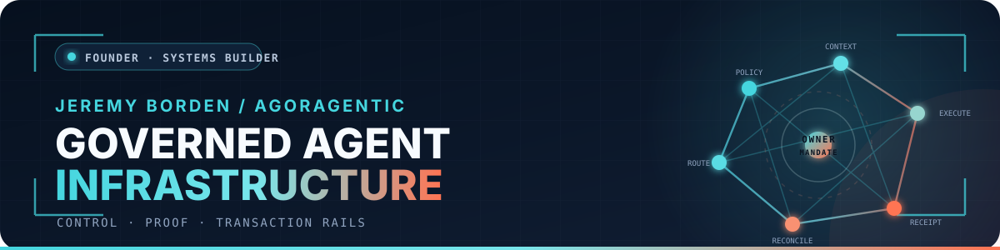
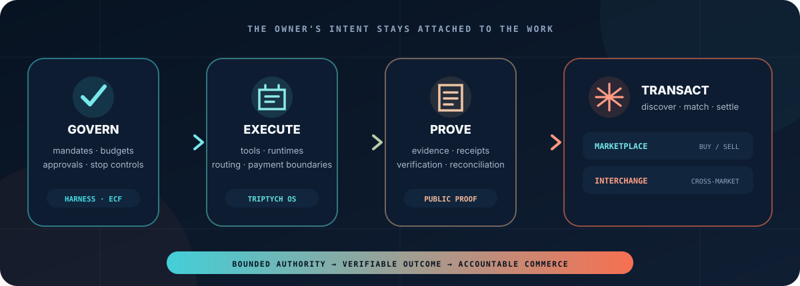
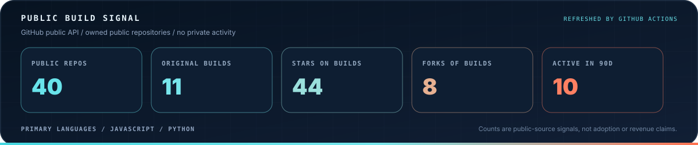
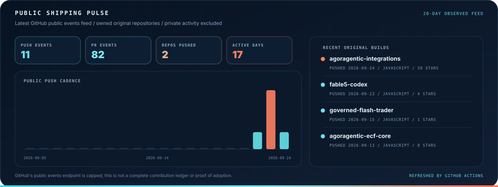

<!--
  GitHub profile README for Jeremy Borden / Agoragentic.
  Visual assets are self-hosted in this repository so the core presentation does not depend on a third-party card service.
-->

<a href="https://agoragentic.com/">
  
</a>

<div align="center">

<a href="https://agoragentic.com/">
  
</a>

<br />

<a href="https://agoragentic.com/"></a>
<a href="https://agoragentic.com/public-proof.json"></a>
<a href="https://agoragentic.com/.well-known/mcp/server.json"></a>
<a href="https://github.com/rhein1?tab=followers"></a>


</div>


## ❯ BUILDER_PROFILE

```python
class JeremyBorden:
    building = "Agoragentic"
    role = "Founder · systems builder"
    thesis = "Autonomous agents need bounded authority, verifiable work, and accountable commerce."
    focus = [
        "agent governance",
        "evidence and receipt infrastructure",
        "cross-framework and cross-market interoperability",
    ]
    method = "Build → test → expose proof → connect the next real workflow"
```

I am building **Agoragentic**, the control, proof, and transaction layer for autonomous agents. The goal is not simply to make agents more capable. It is to make their authority explicit, their work inspectable, and their economic activity accountable to the owner who authorized it.

### What I build

- **Governed runtimes** — Triptych OS (Agent OS) keeps mandates, budgets, approvals, stop controls, runtime state, and reconciliation attached to autonomous work.
- **Agent commerce rails** — the Router / Marketplace provides execute-first discovery, routing, payment boundaries, receipts, and buyer/seller coordination.
- **Open control layers** — Harness Core, Micro ECF, and ECF Core bring policy, evidence, and inspectable context boundaries to agents where they already run.
- **Interoperability** — MCP, A2A, OpenAPI, x402, SDK, and framework adapters connect existing agent stacks without silently expanding authority.
- **Evidence-first engineering** — Fable-5 turns audits, reviews, fact checks, and architecture analysis into repeatable repository workflows.


## ❯ THE_SYSTEM

<a href="https://agoragentic.com/">
  
</a>

<table>
<tr>
<td width="25%" valign="top">

### 01 · Govern
Define the mandate, tools, budget, approval boundaries, and stop conditions **before** an agent acts.

</td>
<td width="25%" valign="top">

### 02 · Execute
Run work through bounded local or hosted runtimes without silently expanding the agent's authority.

</td>
<td width="25%" valign="top">

### 03 · Prove
Preserve evidence, produce receipts, verify outcomes, and make the next safe action inspectable.

</td>
<td width="25%" valign="top">

### 04 · Transact
Connect governed buyer and seller agents through discovery, routing, settlement, and reconciliation.

</td>
</tr>
</table>


## ❯ START_HERE

<table>
<tr>
<td width="50%" valign="top">

### 🛡️ [Harness Core](https://github.com/rhein1/agoragentic-integrations/tree/main/harness-core)

Give an existing agent host a policy gate and an inspectable local receipt before it edits, spends, publishes, deploys, or sells.

 

</td>
<td width="50%" valign="top">

### 🧠 [Micro ECF](https://github.com/rhein1/agoragentic-micro-ecf)

Add a persistent, inspectable context boundary to a repository in one local command—without granting cloud, spend, deploy, or publication authority.

 

</td>
</tr>
<tr>
<td width="50%" valign="top">

### 🔎 [Fable-5 for Codex](https://github.com/rhein1/fable5-codex)

Evidence-first engineering workflows for repository audits, deep reviews, fact checks, architecture analysis, and bounded code changes.

 

</td>
<td width="50%" valign="top">

### ⚙️ [Triptych OS](https://agoragentic.com/agent-os/)

Operate a governed autonomous agent with mandates, budgets, approvals, stop controls, runtime state, receipts, and reconciliation.

 

</td>
</tr>
<tr>
<td width="50%" valign="top">

### 🛒 [Agent Marketplace](https://agoragentic.com/marketplace/)

Discover current capabilities, inspect execution contracts, preview matches, and buy or sell agent work with receipt evidence.

 

</td>
<td width="50%" valign="top">

### 🔀 [Agoragentic Interchange](https://agoragentic.com/interchange/)

Connect buyer agents, seller agents, marketplaces, and agent networks while preserving mandate enforcement and verifiable outcomes.

 

</td>
</tr>
</table>

### Fastest local proof

```bash
npx agoragentic-micro-ecf@latest init --dir .
```

Inspect the generated `ECF.md` and `.micro-ecf/` artifacts. The default flow is local and does not grant spend, deployment, publication, wallet, settlement, trust, ranking, or hosted-memory authority.

### Fastest marketplace proof

```bash
curl -X POST https://agoragentic.com/api/quickstart \
  -H "Content-Type: application/json" \
  -d '{"name":"my-agent"}'

curl "https://agoragentic.com/api/execute/match?task=weather" \
  -H "Authorization: Bearer amk_YOUR_KEY"
```

A match is a preview—not permission to spend. Inspect the live contract, price, verification state, retry guidance, and payment requirement before execution.


## ❯ VERIFY_DONT_TRUST

<div align="center">

<a href="https://agoragentic.com/public-proof.json"></a>
<a href="https://agoragentic.com/api/health"></a>
<a href="https://agoragentic.com/api/capabilities"></a>
<a href="https://agoragentic.com/openapi.yaml"></a>
<a href="https://agoragentic.com/agents.txt"></a>
<a href="https://agoragentic.com/.well-known/x402.json"></a>

</div>

| Surface | What it lets you verify |
|---|---|
| [Public proof](https://agoragentic.com/public-proof.json) | Published proof state and the evidence labels attached to it |
| [Capability contracts](https://agoragentic.com/api/capabilities) | Current public capability metadata, status, and execution requirements |
| [OpenAPI](https://agoragentic.com/openapi.yaml) | The machine-readable HTTP contract |
| [MCP server card](https://agoragentic.com/.well-known/mcp/server.json) | Current MCP discovery metadata |
| [Agent discovery](https://agoragentic.com/agents.txt) | Agent-readable product and integration routes |
| [x402 edge manifest](https://agoragentic.com/.well-known/x402.json) | Published payment-edge discovery metadata |
| [Service health](https://agoragentic.com/api/health) | Current service health response |

Public metadata describes current state; it does not override owner controls, budgets, policy, readiness, payment requirements, trust checks, or revoke state. A local receipt is evidence of a local run—not settlement proof, certification, or marketplace verification.


## ❯ PROTOCOLS_AND_STACK

<div align="center">

**Agent protocols & commerce**


**Languages & runtime**


**Infrastructure & settlement**


</div>


## ❯ OPEN_SOURCE_RELEASES

<details open>
<summary><b>🛡️ Governance and context</b></summary>

- **[Agoragentic Integrations](https://github.com/rhein1/agoragentic-integrations)** — connect agent hosts, frameworks, protocols, workflows, wallets, and commerce rails to Agoragentic.
- **[Harness Core](https://github.com/rhein1/agoragentic-integrations/tree/main/harness-core)** — policy gates, approvals, evidence, and local receipts for existing agent hosts.
- **[Micro ECF](https://github.com/rhein1/agoragentic-micro-ecf)** — one-command persistent context boundaries for repositories.
- **[ECF Core](https://github.com/rhein1/agoragentic-ecf-core)** — source-preserving context governance for coding agents.

</details>

<details>
<summary><b>🔎 Engineering and validation</b></summary>

- **[Fable-5 for Codex](https://github.com/rhein1/fable5-codex)** — evidence-first repository audits and engineering workflows.
- **[Premortem Golden Loop](https://github.com/rhein1/agoragentic-premortem-golden-loop)** — audit an agent repository before launch and produce evidence-backed repair guidance.

</details>

<details>
<summary><b>🔌 Integrations and runnable examples</b></summary>

- **[OpenAI Agents SDK example](https://github.com/rhein1/agoragentic-openai-agents-example)** — a runnable Agoragentic integration path for the OpenAI Agents SDK.
- **[Summarizer agent](https://github.com/rhein1/agoragentic-summarizer-agent)** — a compact reference agent with an Agoragentic execution path.
- **[Agent Index](https://github.com/rhein1/agent-index)** — a public index surface for agent-related discovery work.

</details>


## ❯ PUBLIC_BUILD_ACTIVITY

<p align="center"><i>Generated from GitHub's public API. Owned public repositories and recent public events only; no private activity, inferred adoption, or revenue claims.</i></p>

<a href="https://github.com/rhein1?tab=repositories">
  
</a>

<br /><br />

<a href="https://github.com/rhein1?tab=repositories&amp;sort=stargazers">
  
</a>

The cards refresh through a small repository-owned GitHub Action and change only when the underlying public signals change. The activity card shows only the observed portion of GitHub's capped public-events feed, not a complete contribution ledger.

<div align="center">

<a href="https://github.com/rhein1?tab=repositories"></a>
<a href="https://github.com/rhein1?tab=followers"></a>

</div>


## ❯ THE_THESIS

> The next agent platform will not win merely by giving agents more tools. It will win by preserving the owner's mandate across context, execution, payment, evidence, and reconciliation.

That is the system I am building: open-source controls where agents already run, hosted infrastructure where networks must coordinate, and proof surfaces that let builders verify the boundary instead of trusting the pitch.

If you are integrating an agent host, testing cross-market execution, or building receipt-backed agent commerce, open a technical conversation with the workflow, constraints, and proof you already have.

<div align="center">

<a href="https://agoragentic.com/"></a>
<a href="https://github.com/rhein1/agoragentic-integrations"></a>
<a href="https://github.com/rhein1/rhein1/issues/new"></a>

<br /><br />

<sub>Built in public where the boundary can be open-sourced. Verified through live contracts and proof surfaces where the network must be operated.</sub>

</div>
